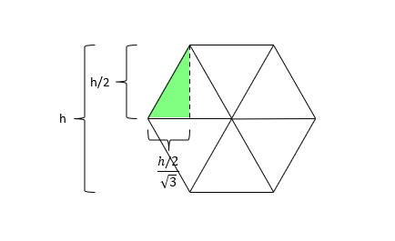

# Hex Grids on a Form

Draw [hexagons](https://en.wikipedia.org/wiki/Hexagon) on a Windows form, and select them with squares.

The hexgon is based on it's flat-side to flat-side height.

## Links:
 * [Visual Studio](https://visualstudio.microsoft.com/vs/)
 * [Windows Desktop Forms](https://docs.microsoft.com/en-us/dotnet/api/system.windows.forms.form)
 * [Git Extensions (Free)](http://gitextensions.github.io/)
 * [ReSharper, Extensions for .NET Developers](https://www.jetbrains.com/resharper/)

 ## Author
:fire: [Greg Eakin](https://www.linkedin.com/in/gregeakin)